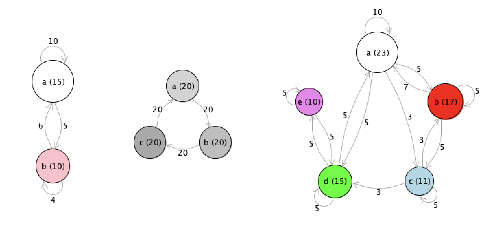

# circular-layout

A lightweight Racket module which draws a graph of nodes and edges in a circular layout, as an alternative to more powerful graph-rendering e.g. graphviz.

Nodes are defined using *make-cl-node* (which sets a name, size, a label and color), and edges are defined using *make-cl-edge* (which defines the source and target nodes, the weight of the edge, a label, and whether the edge is directed, i.e. has an arrow). A list of these nodes and edges are passed to *draw-circular-layout* along with a destination drawing context (dc<%>); scale factor and center of the graph is also specified.

## Example output



## Example usage

```scheme
#lang racket

(require circular-layout)
(require racket/gui/base)

;; a simple graph with 5 nodes and some edges
(define nodes (list
                     (clnode "a"    23    "a (23)"     "white")
                     (clnode "b"    17    "b (17)"      "red")
                     (clnode "c"    11    "c (11)"     "lightblue")
                     (clnode "d"    15    "d (15)"     "green")
                     (clnode "e"    10    "e (10)"     "violet")))


(define edges (list
                     (cledge    "a"     "a"     1    "10"   #t) 
                     (cledge    "a"     "b"     1    "5"    #t) 
                     (cledge    "a"     "c"     1    "3"    #t) 
                     (cledge    "a"     "d"     1    "5"    #t) 

                     (cledge    "b"     "a"     1    "7"    #t)
                     (cledge    "b"     "c"     1    "5"    #t) 
                     (cledge    "b"     "b"     1    "5"    #t)
                     
                     (cledge    "c"     "c"     1    "5"    #t) 
                     (cledge    "c"     "b"     1    "3"    #t) 
                     (cledge    "c"     "d"     1    "3"    #t) 
                     
                     (cledge    "d"     "d"     1    "5"    #t) 
                     (cledge    "d"     "a"     1    "5"    #t) 
                     (cledge    "d"     "e"     1    "5"    #t)
                     
                     (cledge    "e"     "e"     1    "5"    #t) 
                     (cledge    "e"     "d"     1    "5"    #t)))

 ;; set up a drawing canvas with a bitmap, and an image-snip% to display in REPL
(define target (make-bitmap 400 400))
(define dc (new bitmap-dc% [bitmap target]))
(make-object image-snip% target)

;; call the circular-layout function to draw the graph
(draw-circular-layout #:dc dc 
                      #:nodes nodes 
                      #:edges edges 
                      #:center '(200 . 200) 
                      #:scale 10)
```


